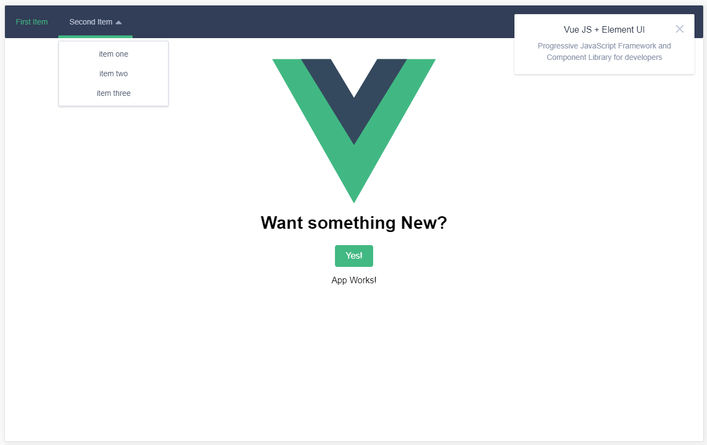

# vue-element-starter

> Vue.js 2 Boilerplate - with Element-UI / Pug / Stylus - Based on vuejs-templates/Webpack

##



## Usage

``` bash
vue init jessenwells/vue-element-starter
npm install
npm run dev
```

## Documentation

- [For this template](http://vuejs-templates.github.io/webpack): common questions specific to this template are answered and each part is described in greater detail
- [For Vue 2.0](http://vuejs.org/guide/): general information about how to work with Vue, not specific to this template
