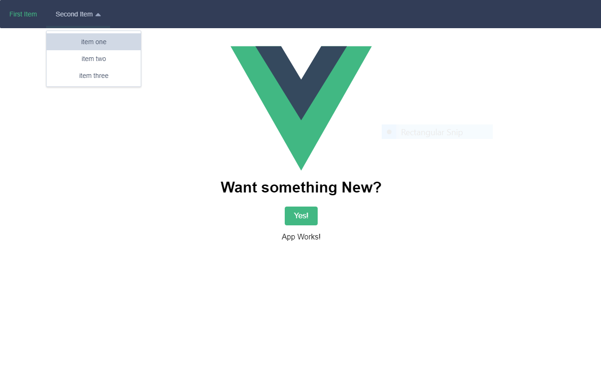

# my-element-starter

> Vue.js 2 Boilerplate - with Element-UI / Pug / Stylus - based on vuejs-templates/Webpack

##



## Build Setup

``` bash

npm install
npm run dev
npm run build

```

For detailed explanation on how things work, checkout the [guide](http://vuejs-templates.github.io/webpack/) and [docs for vue-loader](http://vuejs.github.io/vue-loader).


